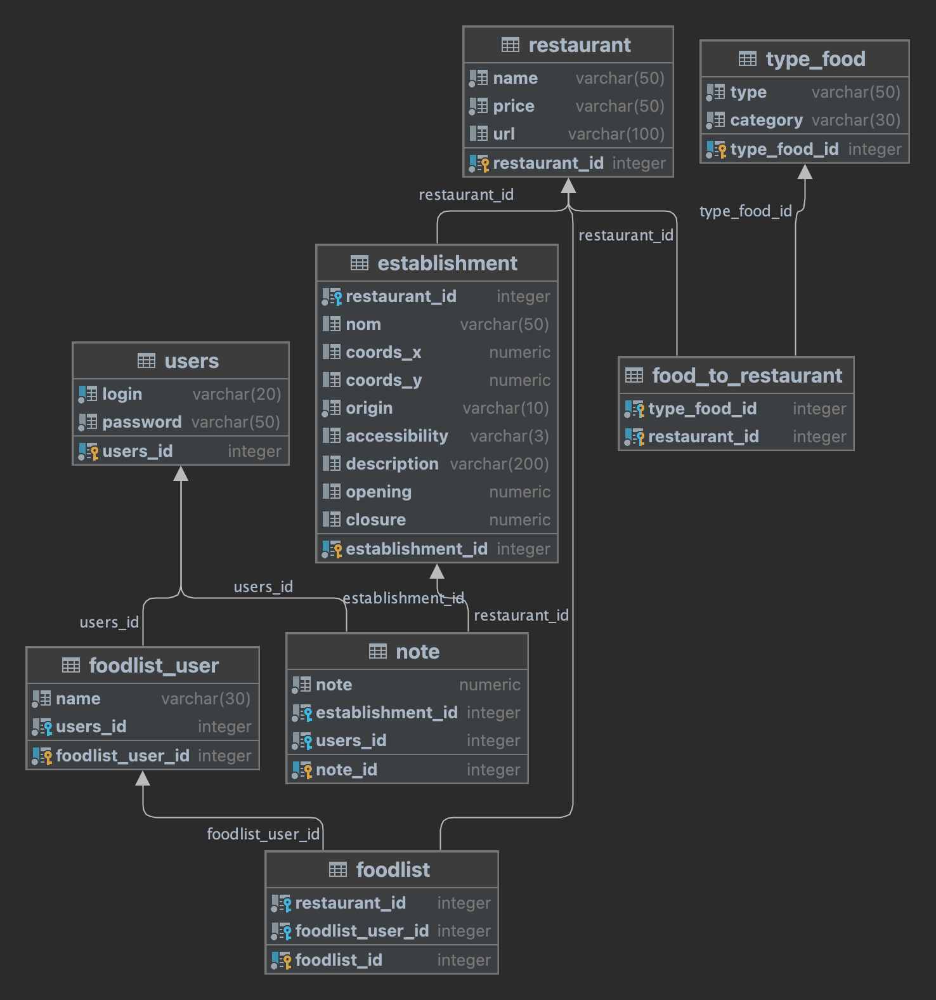

# Menu-Mystery

__Kathleen Equilbec1, Elora Vigo2, Fiona Hak2__
 
1. Lyon University (France)  2. Paris-Saclay University, Orsay (France)

This repository contains the source code for the Menu-Mystery web application developed as part of the web technologies for applications coding contest.
Menu-Mystery, a bilingual (English and French) Progressive Web Application, introduces a fresh approach to discovering Japanese restaurants in Paris. Powered by a sophisticated tech stack, including PostgreSQL, Python with Flask, NGINX, HTML5, CSS, JS, and TensorFlow, it provides a unique and engaging experience. Beyond conventional features, the platform includes innovative functionalities such as a randomized selection of food types and associated restaurants, along with food recognition and chopstick proficiency analysis, adding an extra layer of enjoyment to restaurant exploration.

# Table of contents

- [Requirements](#Requirements)
- [How-to use](#How-to-use)
- [Technical description](#Technical-description)
  - [Database](#Database)
  - [Back end](#Back-end)
  - [Front end](#Front-end)
- [Deployment](#Deployment)
- [License](#License)

## Requirements

To launch the application in developer mode, you need to have docker installed.

On Ubuntu: https://docs.docker.com/engine/install/ubuntu/

On Mac: https://docs.docker.com/desktop/install/mac-install/

## How-to use

The dependencies are built and the application is launched via :

    make launch-app

If necessary, containers and images can be cleaned via :

    docker system prune -f -a

Then to display the results in a browser (tested on Chrome), go to: http://127.0.0.1/

To display the response to queries at back-end level:

    curl http://127.0.0.1:8002/

## Technical description
All parts of the code are linked and run from dependencies built on docker with docker-compose. 

### Database
The database has been built in Postgresql v9.3.

**Figure 1: Overall structure of the database.**

Initially, the restaurant and establishment tables and the information relating to the type of food offered are filled in. User accounts will be created dynamically using a login and password. Each user will be able to create playlists, which are linked to the restaurants' information.

### Back end
The language used is python. Flask is used to open a server for the back end. The database is connected via psycopg2.  Queries on the database are performed using functions and the results are sent in json format to the open server, which can be viewed via port 8002.

### Front end
The front-end is based on the results provided by the back-end, and fetches the results of queries on 8002. A simple display of these results is managed via an ajax request (jquery). Docker-compose allows the link from the back end and uses a nginx server for now. The final results from the front can be viewed via port 80.

## Deployment
Hosting was on hidora.
A docker-compose launch was configured. An endpoint is used to connect to the database (settings -> endpoints -> node id, http, private port (8002) + default). The generated address is used in config.js.
Https has been activated via a self-signed certificate obtained from :

    openssl req -x509 -newkey rsa:4096 -sha256 -days 3650 \
    -nodes -keyout menu-mystery.com.key -out menu-mystery.com.crt -subj "/CN=menu-mystery.com" \
    -addext "subjectAltName=DNS:menu-mystery.com,DNS:*.menu-mystery.com,IP:185.169.94.223"

Until the date of the contest, the application will be available via a https address. You need to accept to pass through firewalls (non-private connection, as the certificate is self-signed):

    https://node173554-menumystery.sh2.hidora.net/

## License

All illustrations for the application were created by Elora Vigo and are released, along with the code, under the APache 2.0 licence.
